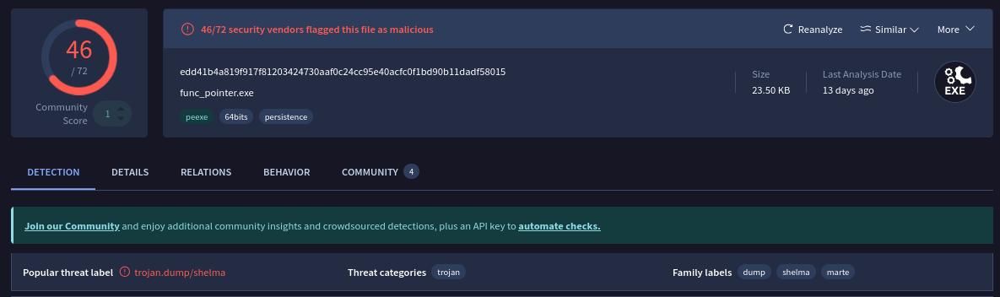

# Payload

For taking the best of this malware Room , I will go with the analysis methodology I mainly go with it on Wild Samples and try to do it on this sample than we solve the lab.

We will see 3 parts : 

Basic Static Analysis.
Basic Dynamic(I won’t do it in this blog).
Behavioral Analysis.

Firstly let’s check the malware real name in VT : 

With a high score on VT, and a threat label of trojan from shelma family.

We try to check for this family to see their Capabilities and those stuff .

On malpedia we can find this : 

According to **Malpedia**, *win.doghousepower*, also aliased as **Shelma**, is a **PyInstaller-based ransomware** that specifically targets **web and database servers**

So that’s not our target.

I searched more and I found this : 

According to NordVPN’s cybersecurity hub, **Shelma** is classified as a **trojan** for Windows known for:
-Keylogging,Data exfiltration,Remote Device access

I guess this looks like what we want 🙂

I go for 

Now we start Checking for the details in VT : 

In the basic properities, we will be interested in these hashes :

 
MD5

  a7b80b7f06c5d31c28a0f4da615d3c51

Imphash(Hash of imported functions)

  49b7913bfffe47b34862d9152dc96809 

SSDEEP(Fuzzy hashing technique to detect similar files)

  384:GU3Vuk8HN6W6Rt6ZgqPKMQmZS+f2IJ7wP:Gewk83g6ZgqgkxfL7w

SHA-256

  edd41b4a819f917f81203424730aaf0c24cc95e40acfc0f1bd90b11dadf58015

The malware was created(2023)(this is usually spoofed).

For the sections of the PE file : 

The malware is entropy is not high and even the Chi2 is normal so the malware is not packed.

For the Imports section we will check it with  Detect it easy

Detect it easy : 

We can see:

BaseAddress 0x140000000

Entrypoint 0x140001125

We check the strings (we can use floss here): 

We can see many functions used in Trojans and we can see the compiler name here.

From those functions we can check the imports section to see if the call was normal or it was loaded dynamically

For GetMooduleHandleA we can check the microsoft docs : 

So we can say that there is some functions loaded dynamically, we will see next

Btw (you can check my repo for a custom GetModuleHandle Can’t be found easily)
https://github.com/AbdouRoumi/Custom-GetModuleHandle

## 2/ Advanced static analysis :

here we will work on the binary in the low assembly level, and try to read our functions

here we can see the main function, How did we know it? 

- **Entry point behavior**: It calls `sub_140001fd7()` early, which is likely an initialization routine
- **Variable setup**: It initializes several variables including buffer sizes (`var_40 = 0x150`)
- **Core program logic**: It performs the main operations:
    - Calls a cryptographic function `sub_1400017d0()` with "UUUUUUUU" as input
    - Searches for "explorer.exe" process using `sub_1400019b5()`
    - Opens the process with `OpenProcess()`
    - Performs process injection via `sub_140001ba9()`

Let’s go deeper in the main func : 

In the main func we can see initializing var_40 which looks like a variable to put the shellcode in.

how did we know ?

I just gained this ultra instinct by previously developing malwares , we always have to create that variable to put our shellcode in. you can check this example:

 https://github.com/AbdouRoumi/Payload_Execution_Control/blob/master/Event_Payload_Execution_Control/Event.cpp

then we can see this , it looks like decryption method , but we will check the function .

This is a decryption method, needs 5 args.

in those line we can see this routine,

- **`arg1`**: Key data (password/key bytes)
- **`arg2`**: Key length
- **`arg3`**: Input data (ciphertext to decrypt)
- **`arg4`**: Input data length
- **`arg5`**: Output buffer (where decrypted plaintext goes)

So we can see this : 

Our key is “UUUUUUUU”

we check our enc_payload : 

So now we have to find the decryption result, this will be found only by : 

## 3/Behavioral Analysis:

We use here x64dbg and start checking, from Binja we find the @ of the decryption 140001e2e

so we start checking and looking for our main func .

this is our decryption func, 

after executing the func we can see the decrypted payload in dump 

Now we can see the Shellcode in the dump

HTB Challenge: 

1- What is the SHA256 hash of func_pointer.exe?

using sha256sum we can have the sha256

2-What compiler is being used?

By using strings , we can find this : 

3-What is the compilation date?

the compilation can be found in virus total, Details history

4-Is ASLR enabled? (True or False)

Here we must check the exe file using objdump

The result gave us DllCharacteristics=0x100

Now we check this in Microsoft documentation:

[https://learn.microsoft.com/en-us/windows/win32/debug/pe-format#dll-characteristics](https://learn.microsoft.com/en-us/windows/win32/debug/pe-format#dll-characteristics)

This means **0x0100 = NX_COMPAT (DEP enabled)** ✅

**Missing: 0x0040 = DYNAMIC_BASE (ASLR disabled)**

5-What is the image base address?
we use objdump -p func_pointer.exe | grep -i "base”

Or from our previous analysis

6-

What is the entry point?

objdump -p func_pointer.exe | grep -i "entry”

0x1125

Task 7 : What are the first 8 bytes of the encrypted payload that is being moved to allocated memory? (format: daffd563616c632e)

We found the payload in the Advanced static analysis

Task 8 : 
What is the key for decryption in hex?

Task 9 : 

Task 10: 

